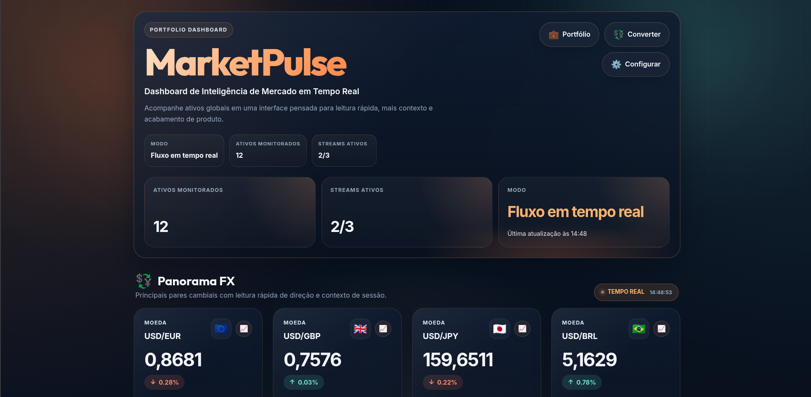

# MarketPulse

> Real-time market dashboard built with React and Vite to showcase front-end product thinking, live data handling, and a stronger visual identity.

> [!NOTE]
> Read this in: **[English](README.md)** | **[Português](README-pt.md)**

[](https://github.com/rafamolina1/MarketPulseOfc)
[](https://react.dev/)
[](https://vitejs.dev/)
[](https://vite-pwa-org.netlify.app/)

## Dashboard Preview



## What It Is

MarketPulse tracks currencies, cryptocurrencies and commodities in a single interface. The project combines real-time updates, historical charts, portfolio tracking, exporting, multilingual support and installable PWA behavior.

This repository is also meant to work as a portfolio piece. The codebase is organized to show not only UI polish, but also component composition, async flows, context-based state, and practical performance decisions.

## Why This Project Is Strong For a Junior Portfolio

- It solves a real product problem instead of being only a static landing page.
- It shows multiple front-end skills in the same app: data fetching, charts, i18n, persistence and responsive UI.
- It has clear separation between UI, business logic and service layer.
- It gives you good talking points for interviews: performance, state management, lazy loading and design system choices.

## Features

- Live tracking for currencies, crypto assets and commodities
- Historical modal charts with multiple time ranges
- Portfolio management with totals and P&L
- CSV and PDF export
- Theme and language preferences persisted in `localStorage`
- PWA manifest and install support
- Lazy-loaded heavy modals and export flows

## Stack

- `React 18`
- `Vite 5`
- `Chart.js` + `react-chartjs-2`
- `i18next` + `react-i18next`
- `vite-plugin-pwa`
- Vanilla CSS with design tokens

## Project Structure

```text
src/
├── components/   # Visual building blocks: cards, modals, charts, splash screen
├── contexts/     # Shared app state such as market data, theme and portfolio
├── services/     # API/websocket/data logic
├── locales/      # Translation files
├── utils/        # Formatting helpers
├── App.jsx       # Main screen composition
└── index.css     # Global tokens and base styling
```

## Running Locally

This project does not require an `.env` file in the current version.

```bash
git clone https://github.com/rafamolina1/MarketPulseOfc.git
cd MarketPulseOfc
npm install
npm run dev
```

Production build:

```bash
npm run build
npm run preview
```

## What To Study In This Codebase

If you are still a junior developer, these are the files worth reading first:

1. `src/App.jsx`
   Main page composition and lazy-loaded flows.
2. `src/contexts/MarketContext.jsx`
   Data orchestration, websocket setup and user preferences.
3. `src/components/HistoricalChart.jsx`
   Chart configuration and memoized chart data.
4. `src/index.css`
   Design tokens, theme variables and global visual system.

## Performance Notes

- Heavy modals are lazy-loaded.
- Number and date formatting can be cached to avoid unnecessary `Intl` object recreation.
- Rollup chunk splitting helps keep the initial bundle more focused.
- `content-visibility` can reduce work for sections that are still outside the viewport.

## Design Direction

The interface aims for a premium market-terminal mood with warm highlights, glass surfaces, and stronger scanability. The goal is to feel more authored than a generic finance template while staying readable on desktop and mobile.

## Author

**Rafael Molina**

- GitHub: [@rafamolina1](https://github.com/rafamolina1)

MarketPulse is a portfolio project built to demonstrate practical front-end execution, product thinking and performance-aware UI work.
